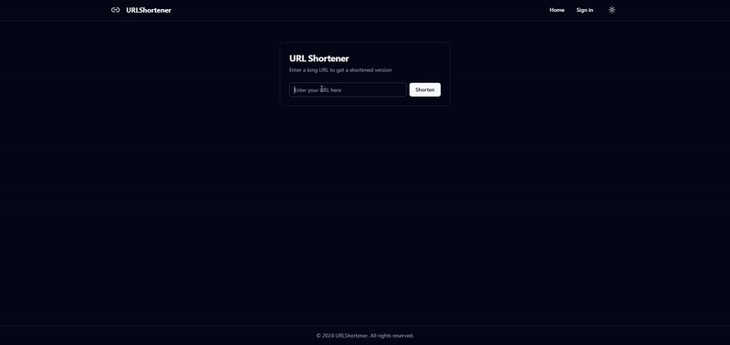

### `README.md`

````markdown
<p align="center">
  
</p>

<h1 align="center">URL Shortener - MERN Stack with NestJS Backend</h1>

<p align="center">
  A powerful and efficient URL shortener built with the MERN stack, featuring a <strong>NestJS backend</strong> for robust server-side operations.
</p>

<p align="center">
  <a href="#features">Features</a> •
  <a href="#tech-stack">Tech Stack</a> •
  <a href="#getting-started">Getting Started</a> •
  <a href="#usage">Usage</a> •
  <a href="#learning-nestjs">Learning NestJS</a> •
  <a href="#contributing">Contributing</a> •
</p>

<p align="center">
  
  
  
  
</p>

## Features

- 🚀 Shorten long URLs into easily shareable links
- 📊 Track click statistics for each shortened URL
- 🔒 User authentication and personalized dashboard
- 🎨 Responsive and intuitive user interface
- ⚡ High-performance backend powered by NestJS

## Tech Stack

- **Frontend**: React, Redux, Tailwind CSS
- **Backend**: NestJS (Node.js framework), Express.js
- **Database**: MongoDB
- **Authentication**: JWT

## Learning NestJS

<p align="center">
  
</p>

As a NestJS beginner, I am discovering how it differs from traditional Node.js frameworks like Express. With its modular architecture and TypeScript-first approach, NestJS makes it easier to build scalable and testable backend services. I chose NestJS for this project to gain hands-on experience in building a more structured backend.

Some key aspects I'm exploring with NestJS in this project:

- Modular architecture
- Dependency injection
- Decorators for routing and request handling
- Integration with MongoDB using Mongoose
- Authentication and authorization with Guards

To learn more about NestJS, check out the [official documentation](https://docs.nestjs.com/).

## Getting Started

1. Clone the repository:

   ```bash
   git clone https://github.com/mehdihassanjony/url-shortener.git
   cd url-shortener
   ```
````

2. Install dependencies for both client and server:

   ```bash
   # Install client dependencies
   cd client
   npm install

   # Install server dependencies
   cd ../server
   npm install
   ```

3. Set up environment variables:
   Create a `.env` file in the server directory and add the following:

   ```dotenv
   MONGODB_URI=your_mongodb_connection_string
   JWT_SECRET=your_jwt_secret
   CLIENT_URL=http://localhost:3000
   ```

4. Start the development servers:

   ```bash
   # Start the NestJS backend server
   cd server
   npm run start:dev

   # In a new terminal, start the React frontend
   cd client
   npm run dev
   ```

## Usage

1. Open your browser and navigate to `http://localhost:3000`.
2. Register or log in to your account.
3. Enter a long URL to get a shortened version.
4. Share the shortened URL and track its clicks from your dashboard.



## Explanation for Data Structure and Uniqueness Handling

**Data Structure**:

- **MongoDB**: MongoDB is used to store mappings between original and short URLs. Each document in the collection contains the original URL, the generated short URL, and other metadata such as click counts and user IDs.

**Uniqueness Handling**:

- **Algorithm**: The `nanoid` library is used to generate a unique 6-character string.
- **Collision Avoidance**: The generated short URL is checked against existing entries in the database. If a collision is found, a new ID is generated until a unique one is created.

## Contributing

Contributions are welcome! Please follow these steps:

1. Fork the repository.
2. Create a new branch (`git checkout -b feature/your-feature`).
3. Commit your changes (`git commit -am 'Add some feature'`).
4. Push to the branch (`git push origin feature/your-feature`).
5. Create a new Pull Request.

## License

This project is licensed under the MIT License - see the [LICENSE](LICENSE) file for details.
